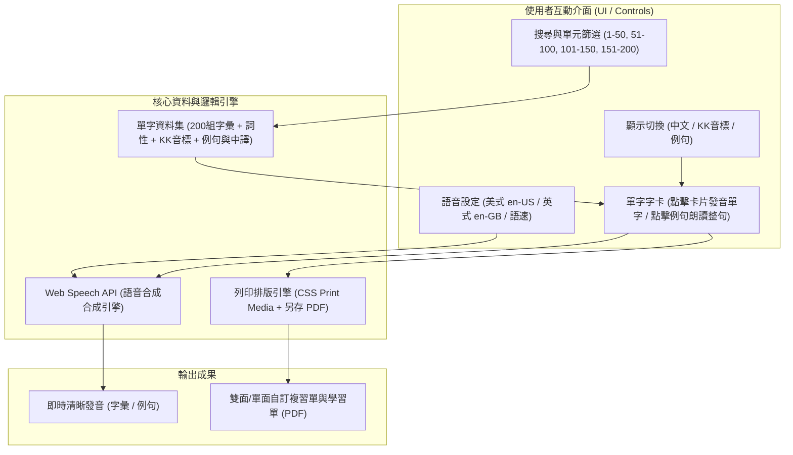

# G4 Advanced M11/M12 英文單字複習互動工具

專為小學四年級（G4 Advanced）M11 與 M12 單元打造的單字複習 Web 應用程式。

- 線上體驗網址：[https://yuchunjie.github.io/shes_kl_Vocabulary/](https://yuchunjie.github.io/shes_kl_Vocabulary/)
- 最佳體驗建議：請優先使用 **Google Chrome** 瀏覽器開啟，以確保 Web Speech 語音引擎具備最完整的發音支援。

---

## 核心功能特色

1. **雙語音引擎與發音切換**
   - 內建瀏覽器原生 Web Speech API。
   - 支援美式英語（en-US）與英式英語（en-GB）切換。
   - 支援三段式語速調節（慢速 0.6x、正常 0.85x、快速 1.0x）。
   - 點擊卡片主體朗讀單字，點擊例句獨立朗讀完整句子。

2. **多維度檢索與客製化顯示**
   - **單元分組**：依序分為全部 1–200，或以每 50 字為組（1–50、51–100、101–150、151–200）。
   - **即時搜尋**：輸入英文字母或中文關鍵字即時動態過濾。
   - **視覺遮罩開關**：可自由開啟或隱藏「中文解釋」、「KK音標」、「例句」，方便學生自測記憶。

3. **列印與 PDF 匯出**
   - 勾選欲複習之單字（支援全選目前篩選範圍與一鍵清除）。
   - 匯出時自動排版為標準 A4 測驗表格，支援選擇是否包含中文與例句。
   - 透過瀏覽器列印視窗即可直接「另存為 PDF」。

---

## 使用方式

本專案為純前端單一靜態網頁設計，零依賴即可運作：

### 1. 線上直接使用
直接以 **Google Chrome** 開啟線上站點：
👉 [https://yuchunjie.github.io/shes_kl_Vocabulary/](https://yuchunjie.github.io/shes_kl_Vocabulary/)

### 2. 本機離線開啟
1. 下載本專案的 [index.html](file:///c:/Users/93052403/Downloads/shes_kl_Vocabulary/index.html)。
2. 使用 **Google Chrome** 點擊兩下直接開啟即可使用。

> 💡 **瀏覽器與發音小提醒**：
> - 強烈建議使用 **Google Chrome**（Windows / macOS / Android / Chromebook 皆支援）。
> - 若使用手機或平板，請避免於 LINE 或 Facebook 內嵌瀏覽器直接點開，請點選右上角選單並選擇「在 Chrome 開啟」，以確保語音發音與列印功能正常運作。
