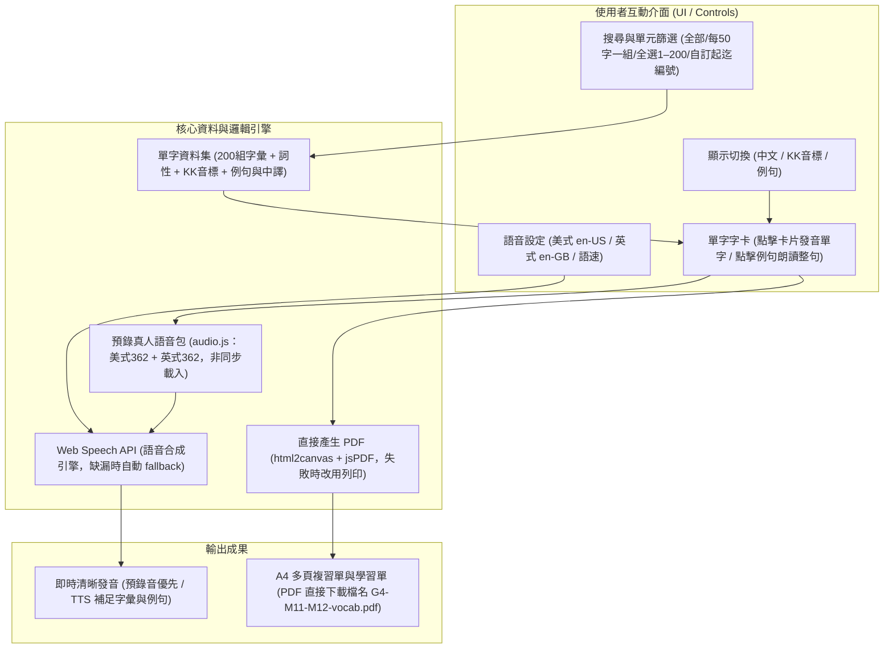

# G4 Advanced M11/M12 英文單字複習互動工具

專為小學四年級（G4 Advanced）M11 與 M12 單元打造的單字複習 Web 應用程式。

- 線上體驗網址：[https://yuchunjie.github.io/shes_kl_Vocabulary/](https://yuchunjie.github.io/shes_kl_Vocabulary/)
- 最佳體驗建議：請優先使用 **Google Chrome** 瀏覽器開啟。發音優先播放內嵌真人錄音（`audio.js` 非同步載入），缺漏時自動改用 Web Speech 語音引擎補足。

---

## 核心功能特色

1. **預錄真人語音優先、TTS 自動補足**
   - 內嵌預錄 MP3 語音包（`audio.js`：美式 362 + 英式 362），`index.html` 僅 38KB 先秒速首屏，語音包非同步背景載入（不再白畫面）。
   - `say()` 先試 `playClip()` 播預錄音，缺漏或播放失敗（`AUDFAIL` 快取）才改用瀏覽器原生 Web Speech API。
   - 支援美式英語（en-US）與英式英語（en-GB）切換。
   - 支援三段式語速調節（慢速 0.6x、正常 0.85x、快速 1.0x），預錄音與 TTS 皆吃同一語速設定。
   - 點擊卡片主體朗讀單字，點擊例句獨立朗讀完整句子。

2. **多維度檢索與客製化顯示**
   - **單元分組**：全部 1–200，或以每 50 字為組（1–50、51–100、101–150、151–200）。
   - **全選 1–200**：一鍵選取全部單字，不受目前篩選影響。
   - **自訂範圍**：輸入起迄編號（如 51 到 80），可「加入選取」或「取消選取」，附選取數量狀態回饋。
   - **即時搜尋**：輸入英文字母或中文關鍵字即時動態過濾。
   - **視覺遮罩開關**：可自由開啟或隱藏「中文解釋」、「KK音標」、「例句」，方便學生自測記憶。

3. **直接產生 PDF（免列印對話框）**
   - 勾選欲複習之單字（支援全選目前篩選範圍、全選 1–200、自訂範圍、一鍵清除）。
   - 點擊「匯出PDF」即以 html2canvas + jsPDF 在瀏覽器端直接排版並下載 `G4-M11-M12-vocab.pdf`（A4 自動分頁量測 794×1123px）。
   - 支援選擇是否包含中文與例句；若直接產生失敗，自動改用列印功能（`window.print()`）備援。

---

## 使用方式

本專案為純前端靜態網頁（`index.html` 約 38KB + `audio.js` 語音包約 8.4MB），PDF 功能依賴 CDN（html2canvas、jsPDF），需連網使用：

### 1. 線上直接使用
直接以 **Google Chrome** 開啟線上站點：
👉 [https://yuchunjie.github.io/shes_kl_Vocabulary/](https://yuchunjie.github.io/shes_kl_Vocabulary/)

### 2. 本機離線開啟（需連網載入 CDN）
1. 下載本專案的 `index.html` 與 `audio.js`，放在**同一個資料夾**（缺 `audio.js` 時仍可開啟，發音自動改用 TTS）。
2. 使用 **Google Chrome** 點擊兩下開啟 `index.html` 即可使用。

> 💡 **瀏覽器與發音小提醒**：
> - 強烈建議使用 **Google Chrome**（Windows / macOS / Android / Chromebook 皆支援）。
> - 若使用手機或平板，請避免於 LINE 或 Facebook 內嵌瀏覽器直接點開，請點選右上角選單並選擇「在 Chrome 開啟」，以確保語音發音與列印功能正常運作。
