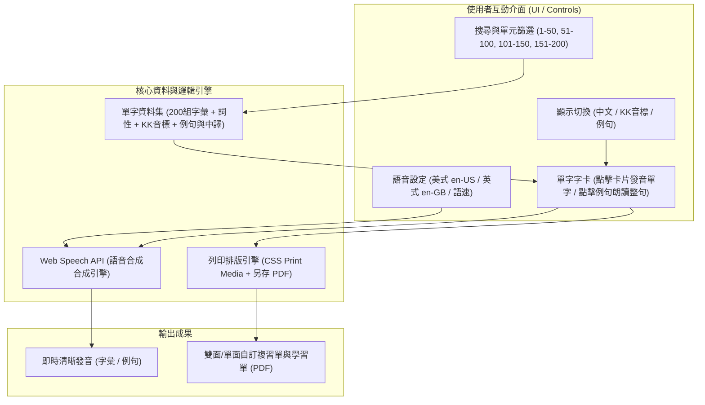

# G4 Advanced M11/M12 英文單字複習互動工具

專為小學四年級（G4 Advanced）M11 與 M12 單元打造的單字複習 Web 應用程式。本專案以零依賴的單一靜態 HTML 檔設計，支援本機離線開啟或部署至靜態網站（如 GitHub Pages）。

---

## 核心功能特色

1. **雙語音引擎與發音切換**
   - 內建瀏覽器原生 Web Speech API。
   - 支援美式英語（en-US）與英式英語（en-GB）切換。
   - 支援三段式語速調節（慢速 0.6x、正常 0.85x、快速 1.0x）。
   - 點擊卡片主體朗讀單字，點擊例句獨立朗讀完整句子。

2. **多維度檢索與客製化顯示**
   - **單元分組**：依序分為全部 1–200，或以每 50 字為組（1–50、51–100、101–150、151–200）。
   - **即時搜尋**：輸入英文字母或中文關鍵字即時動態過濾。
   - **視覺遮罩開關**：可自由開啟或隱藏「中文解釋」、「KK音標」、「例句」，方便學生自測記憶。

3. **列印與 PDF 匯出**
   - 勾選欲複習之單字（支援全選目前篩選範圍與一鍵清除）。
   - 匯出時自動排版為標準 A4 測驗表格，支援選擇是否包含中文與例句。
   - 透過瀏覽器列印視窗即可直接「另存為 PDF」。

---

## 快速使用

本專案無需任何建置環境或安裝套件：

1. 下載或複製本專案的 `index.html`。
2. 以現代瀏覽器（Google Chrome、Microsoft Edge、Apple Safari）直接點擊開啟。
3. 開始朗讀練習或勾選匯出學習單。

> **注意**：語音功能依賴瀏覽器系統之語音引擎，請確保系統音量開啟且非處於通訊軟體內建瀏覽器環境（如 LINE 或 FB 內嵌瀏覽器）。
